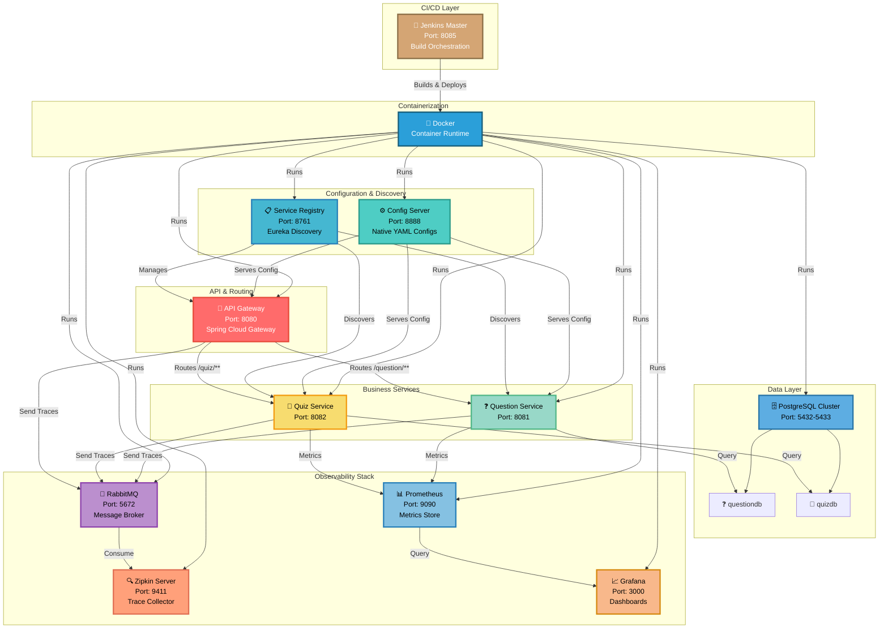
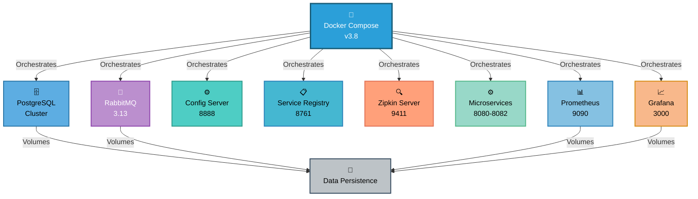
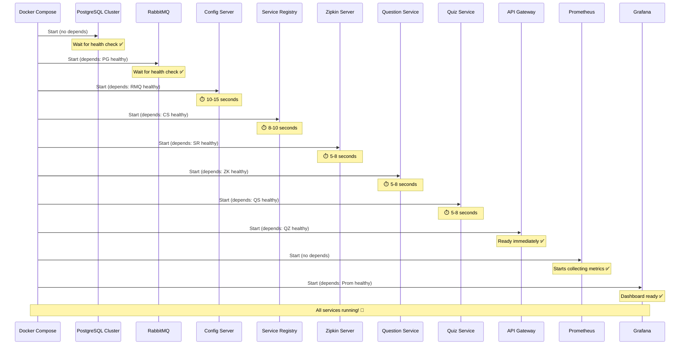
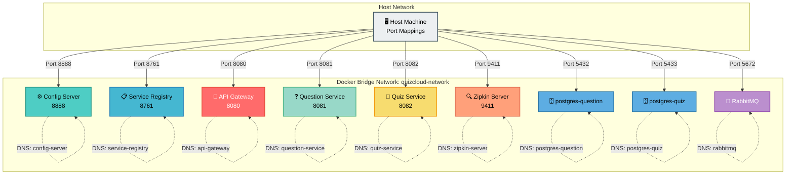

# 🏛️ QuizCloud Infrastructure Setup

> **Comprehensive guide to the distributed microservices infrastructure powering QuizCloud**

---

## 📐 Infrastructure Overview



---

## 🔧 Infrastructure Components

### Core Services

| Component | Port | Technology | Purpose | Location | Docker |
|-----------|------|-----------|---------|----------|--------|
| **Config Server** | 8888 | Spring Cloud Config | Centralized configuration management | `config-server/` | ✅ Yes |
| **Service Registry** | 8761 | Netflix Eureka | Service discovery & registration | `service-registry/` | ✅ Yes |
| **API Gateway** | 8080 | Spring Cloud Gateway | Request routing & load balancing | `api-gateway/` | ✅ Yes |
| **Question Service** | 8081 | Spring Boot + JPA | Question management APIs | `question-service/` | ✅ Yes |
| **Quiz Service** | 8082 | Spring Boot + Resilience4j | Quiz APIs with circuit breakers | `quiz-service/` | ✅ Yes |
| **Zipkin Server** | 9411 | Zipkin + Spring Boot | Distributed trace collection | `zipkin-server/` | ✅ Yes |

### Infrastructure Services

| Component | Port | Technology | Purpose | Running | Docker |
|-----------|------|-----------|---------|---------|--------|
| **PostgreSQL** | 5432 | PostgreSQL 16 Alpine | Relational database | Docker Compose | ✅ Yes |
| **RabbitMQ** | 5672 | RabbitMQ 3.13 | Message broker | Docker/Docker Compose | ✅ Yes |
| **RabbitMQ UI** | 15672 | RabbitMQ Management | RabbitMQ console | Docker/Docker Compose | ✅ Yes |
| **Prometheus** | 9090 | Prometheus | Metrics time-series DB | Docker Compose | ✅ Yes |
| **Grafana** | 3000 | Grafana | Metrics visualization | Docker Compose | ✅ Yes |

### CI/CD Components

| Component | Port | Technology | Purpose | Running | Docker |
|-----------|------|-----------|---------|---------|--------|
| **Jenkins Master** | 8085 | Jenkins LTS | Build orchestration & automation | Docker Container | ✅ Yes |
| **Jenkins Agent Communication** | 50000 | JNLP | Agent connection protocol | Docker Container | ✅ Yes |

---

## 🐳 Docker & Docker Compose

### Dockerfiles Overview

All microservices are containerized using optimized multi-stage builds:

```dockerfile
FROM eclipse-temurin:17-jre-jammy
RUN apt-get update && apt-get install -y curl && rm -rf /var/lib/apt/lists/*
WORKDIR /app
ARG JAR_FILE=target/*.jar
COPY ${JAR_FILE} app.jar
HEALTHCHECK --interval=30s --timeout=3s --start-period=10s --retries=3 \
    CMD curl --fail http://localhost:PORT/actuator/health || exit 1
EXPOSE PORT
ENTRYPOINT ["java", "-jar", "app.jar"]
```

**Features:**
- ✅ Minimal JRE base image (eclipse-temurin:17-jre-jammy)
- ✅ Built-in health checks
- ✅ Production-ready configuration
- ✅ Automatic failure detection

### Docker Compose Orchestration

**Location**: `infra/docker-compose.yml`

Manages complete infrastructure stack:



**Key Features:**
- ✅ Custom bridge network: `quizcloud-network`
- ✅ Volume persistence for all stateful services
- ✅ Health checks with configurable intervals
- ✅ Service dependency ordering
- ✅ Environment variable configuration
- ✅ Automatic database initialization

**Volumes Defined:**
- `postgres-question-data` - Question database storage
- `postgres-quiz-data` - Quiz database storage
- `rabbitmq-data` - Message queue persistence
- `grafana-storage` - Grafana dashboards & settings

### Starting with Docker Compose

```bash
# Navigate to infrastructure directory
cd infra

# Build all images and start services
docker compose up --build -d

# View real-time logs
docker compose logs -f

# View specific service logs
docker compose logs -f config-server
docker compose logs -f question-service

# Check service status
docker compose ps

# Stop all services
docker compose down

# Stop and remove volumes (⚠️ Data loss!)
docker compose down -v
```

---

## 🤖 CI/CD with Jenkins

### Jenkins Setup

**Location**: `jenkins/docker-compose.yml`

```yaml
services:
  jenkins:
    image: jenkins/jenkins:lts
    container_name: jenkins-server
    user: root
    privileged: true
    ports:
      - "8085:8080"      # Web UI
      - "50000:50000"     # JNLP agent port
    volumes:
      - jenkins-data:/var/jenkins_home
      - /var/run/docker.sock:/var/run/docker.sock
    networks:
      - jenkins-network
    restart: unless-stopped
```

**Starting Jenkins:**

```bash
cd jenkins
docker compose up -d

# Get initial admin password
docker exec jenkins-server cat /var/jenkins_home/secrets/initialAdminPassword

# Access Jenkins
open http://localhost:8085
```

### Jenkins Pipeline (Jenkinsfile)

**Location**: `Jenkinsfile` (repository root)

**Pipeline Overview:**


**Pipeline Stages:**

1. **Checkout Code**
   - Agent: Any
   - Clones repository from SCM
   
2. **Compile & Package Microservices**
   - Agent: `maven:3.9.6-eclipse-temurin-17`
   - Builds in architectural order:
     ```bash
     cd config-server && mvn clean package -DskipTests
     cd service-registry && mvn clean package -DskipTests
     cd zipkin-server && mvn clean package -DskipTests
     cd api-gateway && mvn clean package -DskipTests
     cd question-service && mvn clean package -DskipTests
     cd quiz-service && mvn clean package -DskipTests
     ```
   
3. **Deploy Infrastructure & Microservices**
   - Navigates to `infra/` directory
   - Executes Docker Compose lifecycle:
     ```bash
     docker compose down        # Stop previous deployment
     docker compose up --build -d  # Build & start all services
     ```

**Environment Variables:**
```groovy
environment {
    MAVEN_OPTS = '-Dmaven.repo.local=.m2/repository'
}
```

---

## ⚙️ Configuration Server Setup

### Native Profile Configuration

The Config Server operates in **native** mode, serving configuration from local YAML files:

```properties
spring.cloud.config.server.native.search-locations=file:./configs,file:./config-server/configs
spring.profiles.active=native
```

### Configuration Files Structure

**Location**: `config-server/configs/`

```
config-server/configs/
├── api-gateway.yml
│   ├── Server port: 8080
│   ├── Spring Cloud Gateway routes
│   ├── Actuator endpoints
│   └── Distributed tracing settings
├── question-service.yml
│   ├── Database connection: questiondb
│   ├── PostgreSQL credentials
│   ├── JPA/Hibernate settings
│   └── Actuator metrics endpoints
├── quiz-service.yml
│   ├── Database connection: quizdb
│   ├── OpenFeign client configuration
│   ├── **Resilience4j circuit breaker** ✅ FIXED
│   │   └── slidingWindowType: TIME_BASED (was TIME - now corrected)
│   ├── Rate limiter settings
│   └── Metrics configuration
└── service-registry.yml
    ├── Eureka server configuration
    ├── Self-registration settings
    └── Actuator endpoints
```

### Client Configuration Bootstrap

All microservices load configuration via `bootstrap.properties`:

```properties
# bootstrap.properties (in each service)
spring.cloud.config.uri=http://localhost:8888
spring.config.import=configserver:http://localhost:8888
spring.cloud.config.fail-fast=true
```

**⚠️ Critical Setting**: `fail-fast=true` means services **will not start** if Config Server is unavailable. This is intentional for production safety.

### Recent Configuration Fixes ✅

**Circuit Breaker Configuration (quiz-service.yml)**
```yaml
resilience4j:
  circuitbreaker:
    configs:
      default:
        slidingWindowType: TIME_BASED    # ✅ Fixed: was TIME
        slidingWindowSize: 60             # Time window in seconds
        minimumNumberOfCalls: 5           # Min calls before evaluating
        failureRateThreshold: 50          # % failure rate threshold
        waitDurationInOpenState: 30s      # Wait before half-open
    instances:
      questionService:
        baseConfig: default
  ratelimiter:
    instances:
      questionService:
        limitForPeriod: 10                # 10 requests
        limitRefreshPeriod: 1s            # Per second
        timeoutDuration: 0                # No timeout
```

---

## 🗄️ Database Infrastructure

### PostgreSQL in Docker

**Docker Compose Configuration:**

```yaml
services:
  postgres-question:
    image: postgres:16-alpine
    container_name: postgres-question
    environment:
      POSTGRES_USER: postgres
      POSTGRES_PASSWORD: password
      POSTGRES_DB: questiondb
    volumes:
      - postgres-question-data:/var/lib/postgresql/data
      - ../question-table-data.sql:/docker-entrypoint-initdb.d/01-init.sql
    ports:
      - "5432:5432"
    healthcheck:
      test: ["CMD-SHELL", "pg_isready -U postgres"]
      interval: 10s
      timeout: 5s
      retries: 5

  postgres-quiz:
    image: postgres:16-alpine
    container_name: postgres-quiz
    environment:
      POSTGRES_USER: postgres
      POSTGRES_PASSWORD: password
      POSTGRES_DB: quizdb
    volumes:
      - postgres-quiz-data:/var/lib/postgresql/data
      - ../quiz-init.sql:/docker-entrypoint-initdb.d/01-init.sql
    ports:
      - "5433:5432"
    depends_on:
      postgres-question:
        condition: service_healthy
    healthcheck:
      test: ["CMD-SHELL", "pg_isready -U postgres"]
      interval: 10s
      timeout: 5s
      retries: 5
```

### Database Setup

#### Prerequisites
- PostgreSQL 16 Alpine (via Docker)
- Default role: `postgres` with password `password`

#### Automatic Database Creation

Both databases are automatically created by Docker Compose:

- **questiondb** - Question service database
  - Initialized with: `question-table-data.sql`
  - Contains question repository data
  - Mounted at port `5432`

- **quizdb** - Quiz service database
  - Initialized with: `quiz-init.sql`
  - Contains quiz submission data
  - Mounted at port `5433` (to avoid conflict)

#### Database Configuration in Services

**Question Service** (`config-server/configs/question-service.yml`):
```yaml
spring:
  datasource:
    url: jdbc:postgresql://postgres-question:5432/questiondb
    username: postgres
    password: password
    driver-class-name: org.postgresql.Driver
  jpa:
    hibernate:
      ddl-auto: update
    properties:
      hibernate:
        dialect: org.hibernate.dialect.PostgreSQLDialect
```

**Quiz Service** (`config-server/configs/quiz-service.yml`):
```yaml
spring:
  datasource:
    url: jdbc:postgresql://postgres-quiz:5432/quizdb
    username: postgres
    password: password
    driver-class-name: org.postgresql.Driver
  jpa:
    hibernate:
      ddl-auto: update
    properties:
      hibernate:
        dialect: org.hibernate.dialect.PostgreSQLDialect
```

---

## 🐰 Message Broker Setup (RabbitMQ)

### Docker Container Setup

RabbitMQ is used as the **message transport** for distributed tracing:

```bash
docker run -d \
  --name rabbitmq \
  -p 5672:5672 \
  -p 15672:15672 \
  rabbitmq:3-management
```

### Port Mappings

| Port | Service | Purpose |
|------|---------|---------|
| **5672** | AMQP | Message broker protocol |
| **15672** | Management UI | Administration dashboard |

### Access Credentials

- Default Username: `guest`
- Default Password: `guest`
- Management UI: http://localhost:15672

### RabbitMQ Configuration in Services

Services connect to RabbitMQ for trace delivery:

```yaml
spring:
  rabbitmq:
    host: localhost
    port: 5672
    username: guest
    password: guest
```

## 🐰 Message Broker Setup (RabbitMQ)

### Docker Compose Setup

RabbitMQ is orchestrated as part of the infrastructure stack:

```yaml
rabbitmq:
  image: rabbitmq:3.13-management-alpine
  container_name: rabbitmq
  environment:
    RABBITMQ_DEFAULT_USER: guest
    RABBITMQ_DEFAULT_PASS: guest
  ports:
    - "5672:5672"
    - "15672:15672"
  healthcheck:
    test: ["CMD-SHELL", "rabbitmq-diagnostics -q ping"]
    interval: 30s
    timeout: 10s
    retries: 5
  volumes:
    - rabbitmq-data:/var/lib/rabbitmq
  depends_on:
    postgres-quiz:
      condition: service_healthy
  networks:
    - quizcloud-network
```

### Port Mappings

| Port | Service | Purpose | Protocol |
|------|---------|---------|----------|
| **5672** | AMQP | Message broker protocol | AMQP 0-9-1 |
| **15672** | Management UI | Administration & monitoring | HTTP |

### Access Credentials

- **Default Username**: `guest`
- **Default Password**: `guest`
- **Management UI**: http://localhost:15672
- **Container Hostname**: `rabbitmq`

### RabbitMQ Configuration in Services

Services connect to RabbitMQ for trace event delivery via `spring.rabbitmq`:

```yaml
spring:
  rabbitmq:
    host: rabbitmq          # Docker service name
    port: 5672
    username: guest
    password: guest
    virtual-host: /
```

### Trace Event Flow

```
Question Service ─┐
                  ├─→ RabbitMQ ──→ Zipkin Traces
Quiz Service ────┤
                  │
API Gateway ─────┘
```

---

## 📊 Monitoring Stack (Prometheus & Grafana)

### Docker Compose Integration

Both services are managed via `infra/docker-compose.yml`:

```yaml
prometheus:
  image: prom/prometheus:latest
  container_name: prometheus
  command:
    - '--config.file=/etc/prometheus/prometheus.yml'
  volumes:
    - ./prometheus.yml:/etc/prometheus/prometheus.yml
    - prometheus-storage:/prometheus
  ports:
    - "9090:9090"
  networks:
    - quizcloud-network

grafana:
  image: grafana/grafana:latest
  container_name: grafana
  environment:
    GF_SECURITY_ADMIN_PASSWORD: admin
    GF_SECURITY_ADMIN_USER: admin
  volumes:
    - grafana-storage:/var/lib/grafana
  ports:
    - "3000:3000"
  depends_on:
    - prometheus
  networks:
    - quizcloud-network
```

### Prometheus Configuration

**File**: `infra/prometheus.yml`

```yaml
global:
  scrape_interval: 15s
  evaluation_interval: 15s
  external_labels:
    monitor: 'quizcloud-monitor'

scrape_configs:
  - job_name: 'config-server'
    metrics_path: '/actuator/prometheus'
    static_configs:
      - targets: ['config-server:8888']

  - job_name: 'service-registry'
    metrics_path: '/actuator/prometheus'
    static_configs:
      - targets: ['service-registry:8761']

  - job_name: 'api-gateway'
    metrics_path: '/actuator/prometheus'
    static_configs:
      - targets: ['api-gateway:8080']

  - job_name: 'question-service'
    metrics_path: '/actuator/prometheus'
    static_configs:
      - targets: ['question-service:8081']

  - job_name: 'quiz-service'
    metrics_path: '/actuator/prometheus'
    static_configs:
      - targets: ['quiz-service:8082']
```

### Grafana Configuration

- **Default URL**: http://localhost:3000
- **Default Credentials**: `admin` / `admin`
- **Data Source**: Prometheus (`http://prometheus:9090`)
- **Storage**: Docker volume `grafana-storage`

**Quick Setup:**
1. Access http://localhost:3000
2. Login with `admin` / `admin`
3. Add Data Source: Prometheus at `http://prometheus:9090`
4. Create dashboards for metrics visualization

---

## 🔄 Service Startup Sequence (Docker Compose)

## 🔄 Service Startup Sequence (Docker Compose)

The startup order is **automatically managed** by Docker Compose dependency rules:



### Docker Compose Command

```bash
cd infra

# Start all services with automatic orchestration
docker compose up --build -d

# Services start in dependency order automatically
# Health checks ensure readiness before dependents start
```

### Manual Startup (Development/Troubleshooting)

If using traditional startup instead of Docker Compose:

```bash
# ✅ Step 1: Start PostgreSQL (must be running)
# Ensure PostgreSQL is available on localhost:5432

# ✅ Step 2: Start Infrastructure
docker run -d --name rabbitmq \
  -p 5672:5672 -p 15672:15672 \
  rabbitmq:3-management

# ✅ Step 3: Start Services (wait times between each)
cd config-server && mvn spring-boot:run      # ⏱️ Wait 10-15s
# New Terminal
cd service-registry && mvn spring-boot:run   # ⏱️ Wait 8-10s
# New Terminal
cd zipkin-server && mvn spring-boot:run      # ⏱️ Wait 5-8s
# New Terminal
cd question-service && mvn spring-boot:run   # ⏱️ Wait 5-8s
# New Terminal
cd quiz-service && mvn spring-boot:run       # ⏱️ Wait 5-8s
# New Terminal
cd api-gateway && mvn spring-boot:run        # ✅ Ready
```

---

## 🔍 Health Verification

### Container Status Check

```bash
# View all running containers
docker compose ps

# Expected output:
# NAME                   IMAGE                STATUS
# postgres-question      postgres:16-alpine   Up (healthy)
# postgres-quiz          postgres:16-alpine   Up (healthy)
# rabbitmq               rabbitmq:3.13        Up (healthy)
# config-server          quizcloud/config-server    Up (healthy)
# service-registry       quizcloud/service-registry Up (healthy)
# zipkin-server          quizcloud/zipkin-server    Up (healthy)
# question-service       quizcloud/question-service Up (healthy)
# quiz-service           quizcloud/quiz-service     Up (healthy)
# api-gateway            quizcloud/api-gateway      Up (healthy)
# prometheus             prom/prometheus    Up
# grafana                grafana/grafana    Up
```

### Service Health Endpoints

```bash
# Config Server
curl http://localhost:8888/actuator/health

# Service Registry
curl http://localhost:8761/eureka/apps

# API Gateway
curl http://localhost:8080/actuator/health

# Question Service
curl http://localhost:8081/actuator/health

# Quiz Service
curl http://localhost:8082/actuator/health

# Zipkin Server
curl http://localhost:9411/health
```

### Dashboard Access

| Dashboard | URL | Purpose | Initial Action |
|-----------|-----|---------|-----------------|
| 📋 **Eureka Registry** | http://localhost:8761 | View registered services | Verify all 6 services shown |
| 🔍 **Zipkin Traces** | http://localhost:9411 | View distributed traces | Make API call and check traces |
| 📊 **Prometheus** | http://localhost:9090 | Query metrics | Test simple query |
| 📈 **Grafana** | http://localhost:3000 | Dashboards | Login: admin/admin |
| 🐰 **RabbitMQ** | http://localhost:15672 | Queue management | Login: guest/guest |
| 🤖 **Jenkins** | http://localhost:8085 | CI/CD pipeline | Get admin password & setup |

---

## 🛡️ Network & Communication

### Docker Network Architecture



**Key Points:**
- Internal service-to-service communication uses Docker DNS (`service-name:port`)
- Host access uses localhost with exposed ports
- All services on same bridge network can communicate directly
- PostgreSQL dual-instance design with separate ports (5432, 5433)

---

## 📝 Important Configuration Notes

1. **Service Startup Order**: Docker Compose handles this automatically via dependency definitions
2. **Health Checks**: All services have health checks that determine readiness
3. **Fail-Fast Mode**: Services crash if Config Server unavailable (`fail-fast=true`)
4. **Database Initialization**: SQL scripts auto-executed on container startup
5. **Trace Sampling**: Set to 100% (`probability: 1.0`) for complete local tracing
6. **Actuator Endpoints**: All metrics/health exposed via `/actuator/**`
7. **Circuit Breaker**: Resilience4j protects inter-service calls with `TIME_BASED` sliding window

---

## 🔧 Troubleshooting Infrastructure

### Common Issues & Solutions

#### Config Server Connection Timeout
```
Error: Could not locate PropertySource
Cause: Config Server not fully started
Solution: Check logs - docker compose logs config-server
          Wait 15 seconds before other services start
```

#### Service Registration Failure
```
Error: Cannot register with Eureka registry
Cause: Service Registry not running
Solution: docker compose logs service-registry
          Verify port 8761 is accessible
```

#### RabbitMQ Connection Refused
```
Error: Cannot connect to RabbitMQ host
Cause: RabbitMQ container not running or unhealthy
Solution: docker compose logs rabbitmq
          Check: docker ps | grep rabbitmq
          Restart: docker compose restart rabbitmq
```

#### Database Connection Issues
```
Error: org.postgresql.util.PSQLException: Connection refused
Cause: PostgreSQL containers not started or unhealthy
Solution: docker compose logs postgres-question postgres-quiz
          Check health: docker compose ps
          Verify data files exist: question-table-data.sql
```

#### Port Already in Use
```
Error: bind: address already in use
Cause: Port conflict with running service
Solution: docker ps (find conflicting container)
          docker stop <container_id>
          OR change port mapping in docker-compose.yml
```

---

**Infrastructure setup guide completed! 🎉**

For questions or issues, refer to the [README.md](../README.md) and [SETUP_COMPLETE.md](../SETUP_COMPLETE.md) files.
```

## API Gateway Routes

Gateway config is in `config-server/configs/api-gateway.yml`.

```yaml
routes:
  - id: question-service-route
    uri: lb://question-service
    predicates:
      - Path=/question/**
  - id: quiz-service-route
    uri: lb://quiz-service
    predicates:
      - Path=/quiz/**
```

Use:

```text
http://localhost:8080/question/allQuestions
http://localhost:8080/quiz/create
```

## Health Checks

```bash
curl http://localhost:8888/actuator/health
curl http://localhost:8761/actuator/health
curl http://localhost:8080/actuator/health
curl http://localhost:8081/actuator/health
curl http://localhost:8082/actuator/health
curl http://localhost:9411/health
```

## Config Lookup URLs

```bash
curl http://localhost:8888/api-gateway/default
curl http://localhost:8888/question-service/default
curl http://localhost:8888/quiz-service/default
curl http://localhost:8888/service-registry/default
```

## Troubleshooting

- Config clients fail on startup: start Config Server first and verify `http://localhost:8888/actuator/health`.
- Services missing from Eureka: verify `http://localhost:8761` and restart the service after Config Server is healthy.
- Database errors: create `questiondb` and `quizdb`, then confirm credentials in the config server YAML files.
- Prometheus targets down: verify Java services are running on the host and Docker supports `host.docker.internal`.
- No traces in Zipkin: verify RabbitMQ on `5672` and Zipkin on `9411`.

## Versions

- Java: 17
- Spring Boot: 3.5.14
- Spring Cloud: 2025.0.0
- Resilience4j: 2.1.0
- Zipkin: configured in `zipkin-server/pom.xml`

