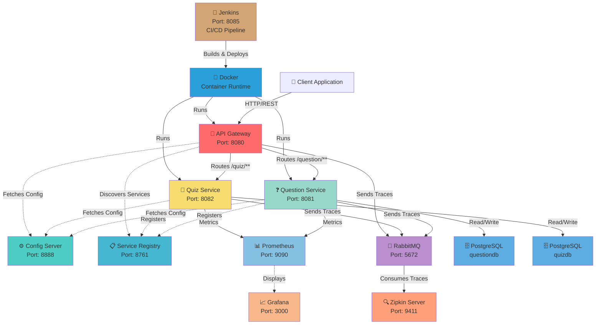

# ☁️ QuizCloud - Microservices Platform

> **A modern Spring Boot microservices ecosystem for intelligent quiz creation and management with enterprise-grade monitoring, tracing, resilience, and CI/CD automation.**

---

## 🎯 Overview

QuizCloud is a sophisticated **microservices architecture** designed to deliver scalable quiz management capabilities. It seamlessly combines a **question bank service** with a **quiz creation engine**, unified through a **centralized API gateway** and powered by **distributed tracing**, **metrics collection**, **circuit breaker resilience**, and **automated CI/CD pipelines with Jenkins**.

### ✨ Core Features

- 🔄 **Service Discovery** - Eureka-based dynamic service registration
- 🎛️ **Centralized Configuration** - Spring Cloud Config Server with native YAML support
- 🚪 **API Gateway** - Intelligent request routing and load balancing
- 📊 **Distributed Tracing** - End-to-end request tracking with Zipkin
- 📈 **Metrics & Monitoring** - Prometheus + Grafana dashboards
- 🛡️ **Resilience** - Circuit breakers and rate limiting via Resilience4j
- 💬 **Inter-Service Communication** - OpenFeign HTTP clients
- 🗄️ **Data Persistence** - PostgreSQL with Spring Data JPA
- 🐰 **Async Processing** - RabbitMQ for trace event transport
- 🐳 **Containerization** - Docker & Docker Compose for all microservices
- 🤖 **CI/CD Automation** - Jenkins pipeline for automated building, testing, and deployment

---

## 🏗️ System Architecture



---

## 📦 Services Breakdown

| Service | Path | Port | Database | Key Features |
|---------|------|------|----------|--------------|
| **Config Server** | `config-server/` | 8888 | — | Centralized configuration management |
| **Service Registry** | `service-registry/` | 8761 | — | Eureka service discovery & health monitoring |
| **API Gateway** | `api-gateway/` | 8080 | — | Request routing, load balancing, trace propagation |
| **Question Service** | `question-service/` | 8081 | `questiondb` | Question CRUD operations, search, filtering |
| **Quiz Service** | `quiz-service/` | 8082 | `quizdb` | Quiz creation, submission, OpenFeign integration, Resilience4j |
| **Zipkin Server** | `zipkin-server/` | 9411 | — | Distributed tracing UI & trace collection |
| **Jenkins** | `jenkins/` | 8085 | — | CI/CD pipeline automation & build orchestration |
| **Prometheus** | `infra/` | 9090 | — | Metrics aggregation & scraping |
| **Grafana** | `infra/` | 3000 | — | Interactive dashboards & alerts |

---

## 🛠️ Technology Stack

| Category | Technology | Version |
|----------|-----------|---------|
| **Language** | Java | 17 LTS |
| **Framework** | Spring Boot | 3.5.14 |
| **Cloud Framework** | Spring Cloud | 2025.0.0 - 2025.0.2 |
| **Service Discovery** | Netflix Eureka | Latest |
| **API Gateway** | Spring Cloud Gateway | Latest |
| **Configuration** | Spring Cloud Config | Latest |
| **Resilience** | Resilience4j | 2.1.0+ |
| **Tracing** | Zipkin + Micrometer | Latest |
| **Metrics** | Prometheus + Micrometer | Latest |
| **Message Queue** | RabbitMQ | 3.13+ |
| **Database** | PostgreSQL | 16 Alpine |
| **HTTP Client** | OpenFeign | Latest |
| **ORM** | Spring Data JPA | Latest |
| **Build Tool** | Maven | 3.9.6+ |
| **CI/CD** | Jenkins | LTS |
| **Containerization** | Docker | Latest |
| **Orchestration** | Docker Compose | v3.8+ |
| **Utilities** | Project Lombok | Latest |

---

## 📋 Prerequisites

Before starting the QuizCloud platform, ensure you have the following installed and configured:

### System Requirements
- ✅ **Java 17+** (LTS recommended)
- ✅ **Maven 3.8+** (or use included `mvnw` / `mvnw.cmd`)
- ✅ **PostgreSQL 13+** (running on `localhost:5432`)
- ✅ **RabbitMQ 3.x** (running on `localhost:5672`)
- ✅ **Docker & Docker Compose** (for monitoring stack)

### Database Setup

Create the required databases and load initial data:

```bash
# Create databases
psql -U postgres -c "CREATE DATABASE questiondb;"
psql -U postgres -c "CREATE DATABASE quizdb;"

# Load question data
psql -U postgres -d questiondb -f question-table-data.sql
```

### Credentials Configuration

Default PostgreSQL credentials in config files:
```yaml
spring.datasource.username: postgres
spring.datasource.password: password
```

Update these in:
- `config-server/configs/question-service.yml`
- `config-server/configs/quiz-service.yml`

---

## ⚙️ Configuration Management

### Centralized Configuration

All service configurations are managed centrally:

```
config-server/configs/
  ├── api-gateway.yml              # Gateway routing & resilience settings
  ├── question-service.yml         # Question service & database config
  ├── quiz-service.yml             # Quiz service & OpenFeign clients
  └── service-registry.yml         # Eureka registry configuration
```

### Configuration Bootstrap

Each microservice connects to the Config Server via `bootstrap.properties`:

```properties
spring.cloud.config.uri=http://localhost:8888
spring.config.import=configserver:http://localhost:8888
spring.cloud.config.fail-fast=true
```

⚠️ **Important**: The `fail-fast=true` setting ensures services fail fast if Config Server is unavailable. **Always start the Config Server first!**

---

## 🚀 Quick Start Guide

### Step 1️⃣: Start Infrastructure

```bash
# RabbitMQ for distributed tracing
docker run -d --name rabbitmq \
  -p 5672:5672 \
  -p 15672:15672 \
  rabbitmq:3-management

# Optional: Prometheus & Grafana (for metrics)
cd monitoring
docker compose up -d
```

### Step 2️⃣: Start Services in Order

Use the provided startup scripts or manually start each service:

**Windows:**
```batch
START_SERVICES.bat
```

**Linux/macOS:**
```bash
chmod +x START_SERVICES.sh
./START_SERVICES.sh
```

**Manual (recommended for troubleshooting):**

Terminal 1 - Config Server:
```bash
cd config-server
mvn spring-boot:run
# Wait 10-15 seconds for startup
```

Terminal 2 - Service Registry:
```bash
cd service-registry
mvn spring-boot:run
# Wait 8-10 seconds
```

Terminal 3 - Zipkin Server:
```bash
cd zipkin-server
mvn spring-boot:run
# Wait 5-8 seconds
```

Terminal 4 - Question Service:
```bash
cd question-service
mvn spring-boot:run
# Wait 5-8 seconds
```

Terminal 5 - Quiz Service:
```bash
cd quiz-service
mvn spring-boot:run
# Wait 5-8 seconds
```

Terminal 6 - API Gateway:
```bash
cd api-gateway
mvn spring-boot:run
```

---

## 🐳 Docker & Container Deployment

### Using Docker Compose (Recommended for Production)

All microservices are containerized and can be deployed using Docker Compose:

```bash
# Navigate to infrastructure directory
cd infra

# Build and start all services
docker compose up --build -d

# View logs
docker compose logs -f

# Stop all services
docker compose down
```

### Docker Compose Stack

The `infra/docker-compose.yml` orchestrates:
- ✅ PostgreSQL instances (questiondb, quizdb)
- ✅ RabbitMQ message broker with management UI
- ✅ All microservices with health checks
- ✅ Proper dependency ordering
- ✅ Volume persistence
- ✅ Custom bridge network for service communication

### Individual Service Containers

Each service has its own optimized **Dockerfile** using multi-stage builds:

```
FROM eclipse-temurin:17-jre-jammy
# - Minimal JRE base image
# - Production-ready
# - Built-in health checks
```

**Example: Build and run Question Service**
```bash
cd question-service
mvn clean package -DskipTests
docker build -t quizcloud/question-service:latest .
docker run -p 8081:8081 \
  --name question-service \
  --network quizcloud-network \
  quizcloud/question-service:latest
```

---

## 🤖 CI/CD Pipeline with Jenkins

### Jenkins Setup

Start the Jenkins server using Docker Compose:

```bash
cd jenkins
docker compose up -d

# Access Jenkins UI
# http://localhost:8085

# Retrieve initial admin password
docker exec jenkins-server cat /var/jenkins_home/secrets/initialAdminPassword
```

### Jenkins Pipeline (`Jenkinsfile`)

The automated pipeline performs:


### Pipeline Stages

1. **Checkout Code** - Pull repository from SCM
2. **Compile & Package** - Build all microservices with Maven 3.9.6
   - Builds in architectural order
   - Skips tests for faster CI builds
3. **Deploy Infrastructure** - Start Docker Compose
   - Orchestrates all containers
   - Ensures service dependencies
4. **Smoke Tests** - Verify service health (optional)
5. **Deployment Complete** - All services running

### Configuration

Edit `Jenkinsfile` to customize:
- Build parameters
- Repository URL
- Deployment environments
- Test execution

---

## 🔍 Health Checks & URLs

### Service Health

```bash
# Config Server
curl http://localhost:8888/actuator/health

# Service Registry (Eureka)
curl http://localhost:8761/eureka/apps

# API Gateway
curl http://localhost:8080/actuator/health

# Question Service
curl http://localhost:8081/actuator/health

# Quiz Service
curl http://localhost:8082/actuator/health

# Zipkin Server
curl http://localhost:9411/health
```

### Dashboard URLs

| Dashboard | URL | Credentials |
|-----------|-----|-------------|
| 📋 **Eureka Service Registry** | http://localhost:8761 | — |
| 🔍 **Zipkin Tracing** | http://localhost:9411 | — |
| 📊 **Prometheus Metrics** | http://localhost:9090 | — |
| 📈 **Grafana Dashboards** | http://localhost:3000 | `admin` / `admin` |
| 🐰 **RabbitMQ Management** | http://localhost:15672 | `guest` / `guest` |

---

## 📞 API Endpoints

### Question Service (via Gateway)

```bash
# Get all questions
curl http://localhost:8080/question/all

# Get question by ID
curl http://localhost:8080/question/{id}
```

### Quiz Service (via Gateway)

```bash
# Create quiz
curl -X POST http://localhost:8080/quiz/create

# Get quiz by ID
curl http://localhost:8080/quiz/{id}

# Submit quiz
curl -X POST http://localhost:8080/quiz/submit
```

---

## 🐛 Troubleshooting

### Service Won't Start

**Problem:** Service fails to connect to Config Server
```
ConfigClientFailFastException: Could not locate PropertySource
```

**Solution:** 
1. Ensure Config Server is running on port 8888
2. Add 10-second delay before starting dependent services
3. Check network connectivity: `curl http://localhost:8888/actuator/health`

### Database Connection Errors

**Problem:** `PSQLException: Connection refused`

**Solution:**
1. Verify PostgreSQL is running: `psql -U postgres -c "\l"`
2. Check credentials in config files match your PostgreSQL setup
3. Ensure databases exist: `question-table-data.sql` is loaded

### RabbitMQ Connection Issues

**Problem:** Services can't connect to RabbitMQ

**Solution:**
1. Verify RabbitMQ container is running: `docker ps | grep rabbitmq`
2. Restart: `docker stop rabbitmq && docker start rabbitmq`
3. Check management UI: http://localhost:15672

---

## 📚 Documentation

- [Infrastructure Setup Guide](INFRASTRUCTURE_SETUP.md)
- [Setup Completion Status](SETUP_COMPLETE.md)
- [Service Startup Scripts](START_SERVICES.bat)

---

## 🤝 Contributing

1. Fork the repository
2. Create a feature branch: `git checkout -b feature/amazing-feature`
3. Commit changes: `git commit -m 'Add amazing feature'`
4. Push to branch: `git push origin feature/amazing-feature`
5. Open a Pull Request

---

## 📄 License

This project is licensed under the MIT License - see the LICENSE file for details.

---

## 🙋‍♂️ Support

For issues, questions, or suggestions:
- Open an issue on GitHub
- Check existing issues for solutions
- Refer to [Troubleshooting](#-troubleshooting) section

---

**Happy Quizzing! 🎯✨**

- If a client service fails immediately, check that Config Server is running on port `8888`.
- If services do not appear in Eureka, check `http://localhost:8761` and the `eureka.client.service-url.defaultZone` values in `config-server/configs`.
- If database startup fails, confirm `questiondb` and `quizdb` exist and credentials match the config files.
- If Prometheus targets are down, confirm the Java services are running on the host and Docker can resolve `host.docker.internal`.
- If traces do not appear in Zipkin, confirm RabbitMQ and Zipkin are both running.

