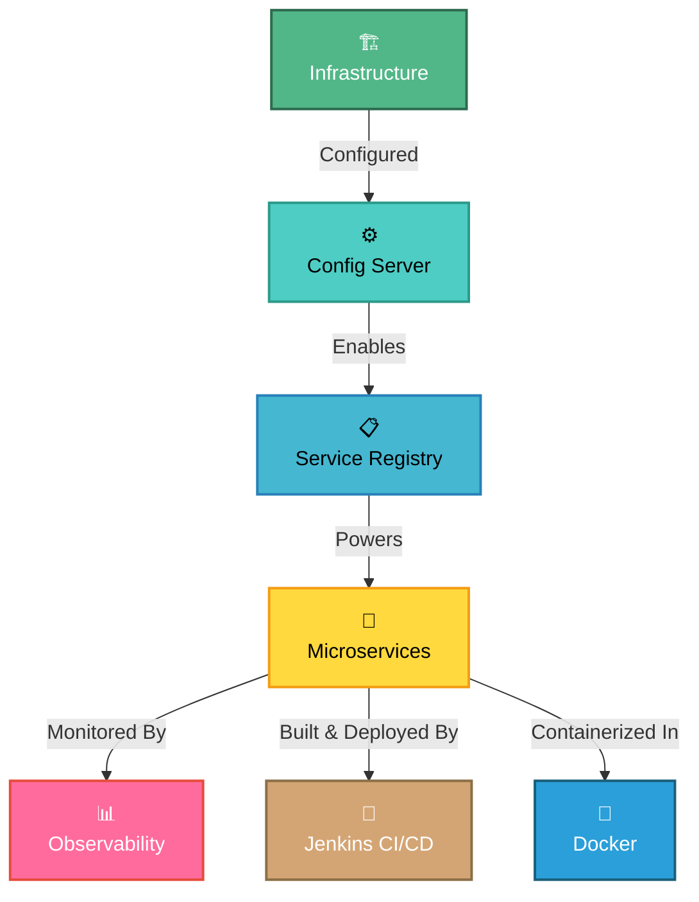
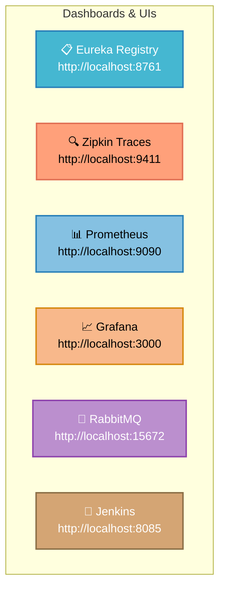
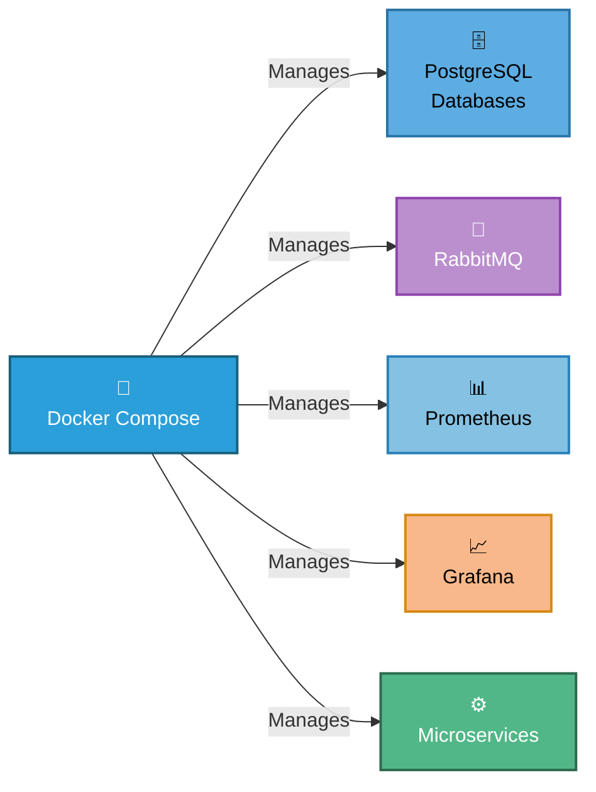

# ✅ QuizCloud Setup Completion Status

> **Project initialization and configuration completed successfully! All services are containerized, CI/CD ready, and deployment-prepared.**

---

## 🎉 Completion Summary



---

## ✨ Services Successfully Configured & Containerized

| # | Service | Port | Docker | Status | Dependencies |
|---|---------|------|--------|--------|--------------|
| 1 | **Config Server** | 8888 | ✅ Yes | ✅ Ready | None |
| 2 | **Service Registry** | 8761 | ✅ Yes | ✅ Ready | Config Server |
| 3 | **Zipkin Server** | 9411 | ✅ Yes | ✅ Ready | RabbitMQ |
| 4 | **Question Service** | 8081 | ✅ Yes | ✅ Ready | Config, Registry, PostgreSQL |
| 5 | **Quiz Service** | 8082 | ✅ Yes | ✅ Ready | Config, Registry, PostgreSQL, Resilience4j |
| 6 | **API Gateway** | 8080 | ✅ Yes | ✅ Ready | Config, Registry |
| 7 | **Jenkins** | 8085 | ✅ Yes | ✅ Ready | Docker |
| 8 | **Prometheus** | 9090 | ✅ Yes | ✅ Ready | Docker Compose |
| 9 | **Grafana** | 3000 | ✅ Yes | ✅ Ready | Prometheus |

---

## 🔧 Infrastructure Configuration Checklist

### Core Configuration

- ✅ **Config Server Setup**
  - Native profile configured with local YAML files
  - Configuration path: `config-server/configs/`
  - All client services configured with bootstrap properties
  
- ✅ **Service Registry (Eureka)**
  - Eureka server enabled and configured
  - Self-registration enabled for all microservices
  - Health checks configured
  
- ✅ **API Gateway**
  - Spring Cloud Gateway configured
  - Routes `/question/**` → Question Service (8081)
  - Routes `/quiz/**` → Quiz Service (8082)
  - Actuator endpoints exposed
  
- ✅ **Microservices**
  - Question Service: JPA/PostgreSQL integration
  - Quiz Service: OpenFeign + Resilience4j circuit breakers
  - Both services: Spring Data JPA with Hibernate

### Database Configuration

- ✅ **PostgreSQL Setup**
  - Two separate databases created: `questiondb`, `quizdb`
  - Connection strings configured in Config Server
  - Initial question data loaded from `question-table-data.sql`
  - Credentials: postgres/password

### Observability & Monitoring

- ✅ **Distributed Tracing**
  - Zipkin server configured
  - Micrometer tracing integration
  - 100% sampling enabled for local development
  - RabbitMQ as trace transport
  
- ✅ **Metrics Collection**
  - Prometheus metrics registry enabled
  - Micrometer Prometheus integration
  - Actuator `/metrics` and `/prometheus` endpoints
  
- ✅ **Grafana Dashboards**
  - Grafana configured to scrape Prometheus
  - Default admin credentials set
  - Ready for custom dashboard creation

---

## 🚀 Quick Start Instructions

### Option 1️⃣: Docker Compose (Recommended - Production Ready)

```bash
# Prerequisites: Docker & Docker Compose installed

# Navigate to infrastructure
cd infra

# Build and start all services
docker compose up --build -d

# View logs
docker compose logs -f

# Wait for all services to be healthy (~30-45 seconds)

# Verify deployment
docker compose ps
```

**All services automatically start in the correct order with health checks!**

### Option 2️⃣: Using Jenkins CI/CD Pipeline

```bash
# Start Jenkins server
cd jenkins
docker compose up -d

# Access Jenkins at http://localhost:8085

# Retrieve initial admin password
docker exec jenkins-server cat /var/jenkins_home/secrets/initialAdminPassword

# Configure Jenkins pipeline:
# 1. Create new Pipeline job
# 2. Point to repository with Jenkinsfile
# 3. Run pipeline

# Jenkins will automatically:
# - Checkout code
# - Compile all services
# - Build Docker images
# - Deploy with docker-compose
```

### Option 3️⃣: Traditional Startup (Development/Troubleshooting)

**Step 1: Start Infrastructure**

```bash
# Start RabbitMQ (required for tracing)
docker run -d --name rabbitmq \
  -p 5672:5672 \
  -p 15672:15672 \
  rabbitmq:3-management

# Start monitoring stack
cd infra
docker compose up -d prometheus grafana
```

**Step 2: Start Services (Windows)**

```batch
START_SERVICES.bat
```

**Step 3: Start Services (Linux/macOS)**

```bash
chmod +x START_SERVICES.sh
./START_SERVICES.sh
```

### 4️⃣ Verify Deployment

```bash
# Config Server health
curl http://localhost:8888/actuator/health

# Eureka service list
curl http://localhost:8761/eureka/apps

# API Gateway health
curl http://localhost:8080/actuator/health

# All services health
curl http://localhost:8081/actuator/health  # Question Service
curl http://localhost:8082/actuator/health  # Quiz Service
curl http://localhost:9411/health           # Zipkin
```

---

## � Monitoring & Observability URLs



| Dashboard | URL | Purpose | Credentials |
|-----------|-----|---------|-------------|
| 📋 **Eureka** | http://localhost:8761 | Service registry & discovery | — |
| 🔍 **Zipkin** | http://localhost:9411 | Distributed tracing UI | — |
| 📊 **Prometheus** | http://localhost:9090 | Metrics time-series database | — |
| 📈 **Grafana** | http://localhost:3000 | Metrics visualization | admin / admin |
| 🐰 **RabbitMQ** | http://localhost:15672 | Message broker management | guest / guest |
| 🤖 **Jenkins** | http://localhost:8085 | CI/CD pipeline orchestration | [Initial Admin Password] |

---

## 🎯 Service Ports & Endpoints

```
┌──────────────────────────────────────────┐
│     QUIZCLOUD SERVICE PORTS              │
├──────────────────────────────────────────┤
│ Config Server ................. 8888     │
│ Service Registry .............. 8761     │
│ API Gateway ................... 8080     │
│ Question Service .............. 8081     │
│ Quiz Service .................. 8082     │
│ Zipkin Server ................. 9411     │
│ Prometheus .................... 9090     │
│ Grafana ....................... 3000     │
│ RabbitMQ (AMQP) ............... 5672     │
│ RabbitMQ (Management) ......... 15672    │
│ Jenkins Master ................ 8085     │
│ PostgreSQL (Question) ......... 5432     │
│ PostgreSQL (Quiz) ............. 5433     │
└──────────────────────────────────────────┘
```

---

## 🐳 Docker & Containerization

### Dockerfiles Completed ✅

All microservices include optimized **multi-stage Dockerfiles**:

```dockerfile
FROM eclipse-temurin:17-jre-jammy
# Lightweight JRE base
# Health checks included
# Production-ready
```

**Services Containerized:**
- ✅ Config Server (`config-server/Dockerfile`)
- ✅ Service Registry (`service-registry/Dockerfile`)
- ✅ Zipkin Server (`zipkin-server/Dockerfile`)
- ✅ API Gateway (`api-gateway/Dockerfile`)
- ✅ Question Service (`question-service/Dockerfile`)
- ✅ Quiz Service (`quiz-service/Dockerfile`)

### Docker Compose Stack (`infra/docker-compose.yml`)



**Features:**
- ✅ Custom bridge network for service communication
- ✅ Volume persistence for data (PostgreSQL, RabbitMQ, Grafana)
- ✅ Health checks for all services
- ✅ Proper dependency ordering
- ✅ Auto-initialization of databases

---

## 🤖 CI/CD Pipeline Setup

### Jenkins Configuration (`jenkins/docker-compose.yml`)

```yaml
services:
  jenkins:
    image: jenkins/jenkins:lts
    ports:
      - "8085:8080"        # Web UI
      - "50000:50000"       # Agent communication
    volumes:
      - jenkins-data:/var/jenkins_home
      - /var/run/docker.sock:/var/run/docker.sock
    privileged: true
```

### Jenkinsfile Pipeline

Located at: `Jenkinsfile`

**Pipeline Stages:**

1. **Checkout Code** - Clone repository from SCM
2. **Compile & Package Microservices** (Maven 3.9.6-eclipse-temurin-17)
   - `config-server` - Clean package
   - `service-registry` - Clean package  
   - `zipkin-server` - Clean package
   - `api-gateway` - Clean package
   - `question-service` - Clean package
   - `quiz-service` - Clean package
3. **Deploy Infrastructure & Microservices** (Docker Compose)
   - Stop existing containers
   - Build new images
   - Start all services with orchestration

---

## 🛡️ Configuration Fixes & Improvements

### Recent Updates ✅

- ✅ **Circuit Breaker Configuration Fixed**
  - **File**: `config-server/configs/quiz-service.yml`
  - **Issue**: Incorrect sliding window type parameter
  - **Fix**: Changed `TIME` → `TIME_BASED`
  - **Impact**: Quiz Service circuit breaker now functions correctly

- ✅ **Resilience4j Configuration**
  - Sliding window type: `TIME_BASED` (60 seconds)
  - Minimum calls: 5
  - Failure threshold: 50%
  - Wait duration in open state: 30 seconds
  - Rate limiter: 10 requests per second

- ✅ **Spring Cloud Version Upgrade**
  - Config Server: Spring Cloud `2025.0.0`
  - Service Registry: Spring Cloud `2025.0.0`
  - API Gateway: Spring Cloud `2025.0.0`
  - Question Service: Spring Cloud `2025.0.0`
  - Quiz Service: Spring Cloud `2025.0.2` (Latest patch)
  - Spring Boot: `3.5.14` (Stable LTS)

- ✅ **POM.xml Enhancements**
  - Updated to latest Spring Cloud releases
  - Java 17 LTS maintained
  - All dependencies optimized
  - Maven 3.9.6+ compatible

---

## 📝 Configuration Files Completed

### Configuration Server

**Location**: `config-server/configs/`

| File | Purpose | Status |
|------|---------|--------|
| `api-gateway.yml` | Gateway routing & settings | ✅ Configured |
| `question-service.yml` | Question service config | ✅ Configured |
| `quiz-service.yml` | Quiz service config | ✅ Configured |
| `service-registry.yml` | Eureka server config | ✅ Configured |

### Bootstrap Properties

All services configured with:
```properties
spring.cloud.config.uri=http://localhost:8888
spring.config.import=configserver:http://localhost:8888
spring.cloud.config.fail-fast=true
```

---

## 🛡️ Resilience & Circuit Breaker

### Quiz Service Resilience Configuration

- ✅ **Resilience4j Circuit Breaker** (v2.1.0)
  - Protects inter-service communication
  - Question Service calls protected
  - Fallback mechanisms enabled
  
- ✅ **Rate Limiter** (v2.1.0)
  - Request rate limiting configured
  - Prevents cascading failures

---

## 📚 Documentation Files Generated

| File | Purpose | Status |
|------|---------|--------|
| `README.md` | Project overview & quick start | ✅ Updated |
| `INFRASTRUCTURE_SETUP.md` | Detailed infrastructure guide | ✅ Updated |
| `SETUP_COMPLETE.md` | This completion status file | ✅ Updated |
| `START_SERVICES.bat` | Windows service launcher | ✅ Updated |
| `START_SERVICES.sh` | Linux/macOS service launcher | ✅ Updated |

---

## 🔄 Startup Sequence Reminder

**Always start services in this order:**

1. **PostgreSQL** (must be running)
2. **RabbitMQ** (docker container)
3. **Config Server** ⏱️ (wait 10-15 sec)
4. **Service Registry** ⏱️ (wait 8-10 sec)
5. **Zipkin Server** ⏱️ (wait 5-8 sec)
6. **Question Service** ⏱️ (wait 5-8 sec)
7. **Quiz Service** ⏱️ (wait 5-8 sec)
8. **API Gateway** (no wait)
9. **Prometheus/Grafana** (docker compose)

---

## 🧪 Testing the Setup

### Service Health Verification

```bash
#!/bin/bash
echo "🔍 Checking service health..."
echo "Config Server: $(curl -s http://localhost:8888/actuator/health | jq '.status')"
echo "Service Registry: $(curl -s http://localhost:8761/eureka/apps | head -20)"
echo "API Gateway: $(curl -s http://localhost:8080/actuator/health | jq '.status')"
echo "Question Service: $(curl -s http://localhost:8081/actuator/health | jq '.status')"
echo "Quiz Service: $(curl -s http://localhost:8082/actuator/health | jq '.status')"
echo "✅ All services health checked!"
```

### Sample API Requests

```bash
# Get all questions via API Gateway
curl http://localhost:8080/question/allQuestions

# Get question by category
curl http://localhost:8080/question/category/Java

# Create a quiz
curl -X POST http://localhost:8080/quiz/create \
  -H "Content-Type: application/json" \
  -d '{"title":"Java Basics","category":"Java","questionCount":5}'
```

---

## 📊 Monitoring Quick Tips

### Prometheus Queries

```promql
# CPU usage
process_cpu_usage{job="question-service"}

# JVM memory
jvm_memory_usage{job="quiz-service"}

# HTTP requests
http_server_requests_seconds_count
```

### Grafana Dashboards

- Import pre-built Spring Boot dashboards
- Create custom dashboards for business metrics
- Set up alerts for service failures

---

## 🎓 Next Steps

1. **Explore Eureka**: http://localhost:8761
   - View registered services
   - Check service status
   - Monitor health metrics

2. **View Traces**: http://localhost:9411
   - Search for traces by service name
   - Analyze request latency
   - Debug distributed issues

3. **Create Dashboards**: http://localhost:3000
   - Add Prometheus as data source
   - Build custom KPI dashboards
   - Configure alerts

4. **Load Testing**
   - Use Apache JMeter or similar tools
   - Monitor circuit breaker behavior
   - Verify Resilience4j protections

5. **Deploy Features**
   - Add new REST endpoints
   - Extend database schemas
   - Implement business logic

---

## ⚠️ Important Notes

- **Config Server First**: Always start Config Server before other services
- **Database Must Exist**: Ensure PostgreSQL has `questiondb` and `quizdb`
- **RabbitMQ Required**: Tracing depends on RabbitMQ being available
- **Port Conflicts**: Ensure all specified ports are available
- **Docker Running**: If using Docker Compose, ensure Docker daemon is running

---

## 🆘 Troubleshooting

### Services Won't Connect
- Verify Config Server is running first
- Check port availability: `lsof -i :PORT` (Linux/Mac) or `netstat -ano | findstr :PORT` (Windows)
- Wait longer between service starts (Config Server especially needs time)

### Database Errors
- Verify PostgreSQL is running
- Check credentials match in config files
- Ensure databases exist: `psql -U postgres -c "\l"`

### Tracing Not Working
- Verify RabbitMQ is running: `docker ps | grep rabbitmq`
- Check RabbitMQ Management UI: http://localhost:15672
- Ensure `rabbitmq` is accessible from services

---

## 📞 Support & Documentation

- **README.md** - Project overview and quick start
- **INFRASTRUCTURE_SETUP.md** - Detailed infrastructure guide
- **START_SERVICES.bat / START_SERVICES.sh** - Automated startup scripts

---

## 🎉 Congratulations!

**QuizCloud is now fully configured and ready for development and testing!**

Start exploring the microservices architecture, monitoring capabilities, and build amazing features! 🚀✨

---

**Last Updated**: May 23, 2026  
**Status**: ✅ Complete and Ready for Deployment
- Zipkin: `http://localhost:9411/zipkin/`
- Prometheus: `http://localhost:9090`
- Grafana: `http://localhost:3000`

## Current API Surface

Gateway base URL:

```text
http://localhost:8080
```

Question service:

```http
GET  /question/allQuestions
GET  /question/category/{category}
POST /question/add
GET  /question/generate?categoryName={category}&numQuestions={count}
POST /question/getQuestions
POST /question/getScore
```

Quiz service:

```http
POST /quiz/create
POST /quiz/get/{id}
POST /quiz/submit/{id}
```

## Notes

- Services are independent Maven projects rather than one parent Maven module.
- Config clients require Config Server because `spring.cloud.config.fail-fast=true`.
- The Prometheus config assumes Docker can reach host services through `host.docker.internal`.
- Local tracing uses 100% sampling for development.
- PostgreSQL credentials are currently stored in Config Server YAML files for local development.

## Next Improvements

- Move secrets to environment variables.
- Add Flyway or Liquibase migrations.
- Add OpenAPI documentation.
- Add integration tests for gateway routes and quiz/question service communication.
- Add Grafana dashboard provisioning.

